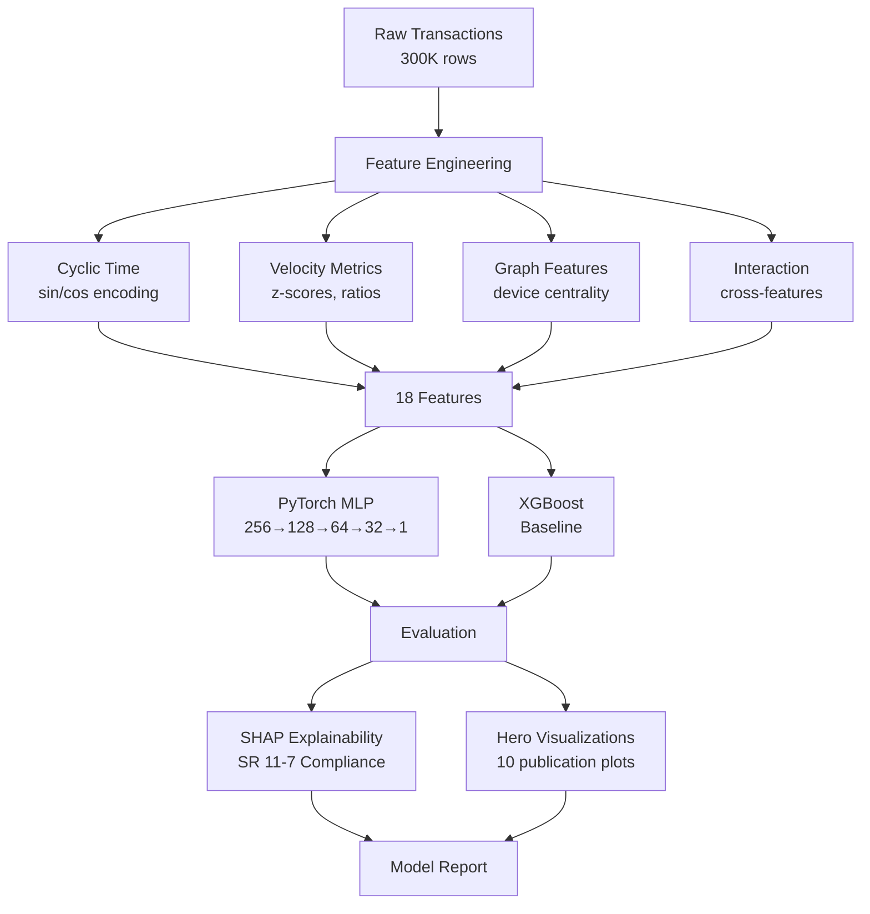
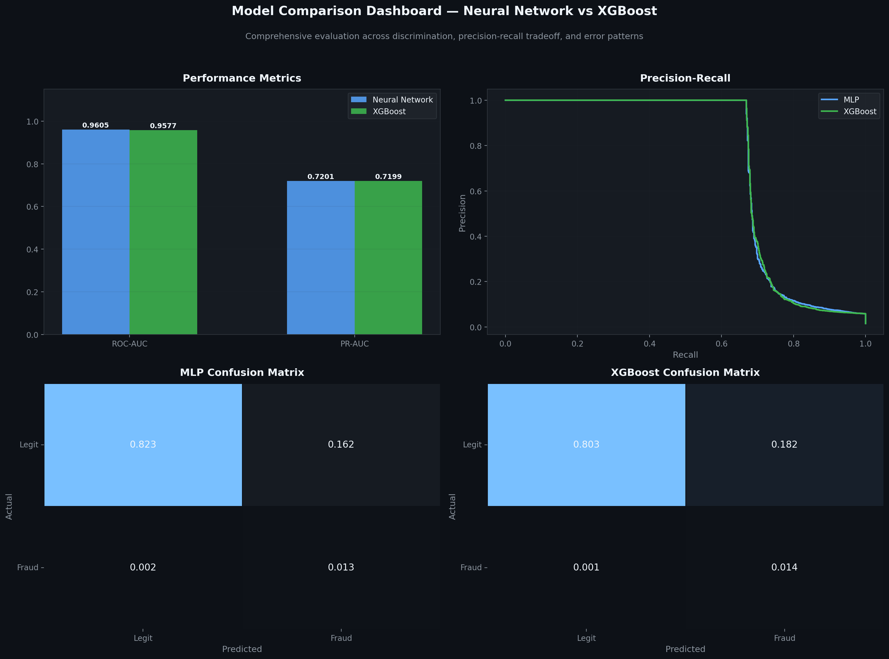
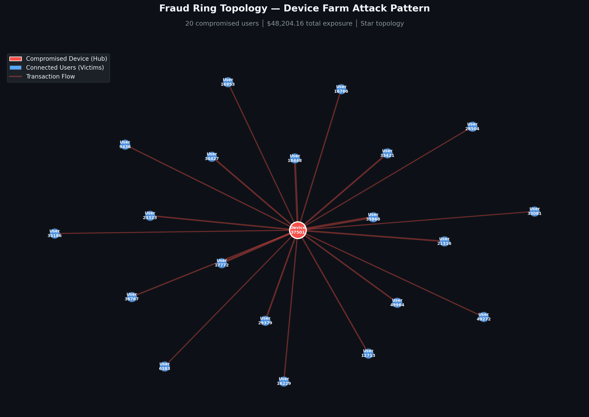
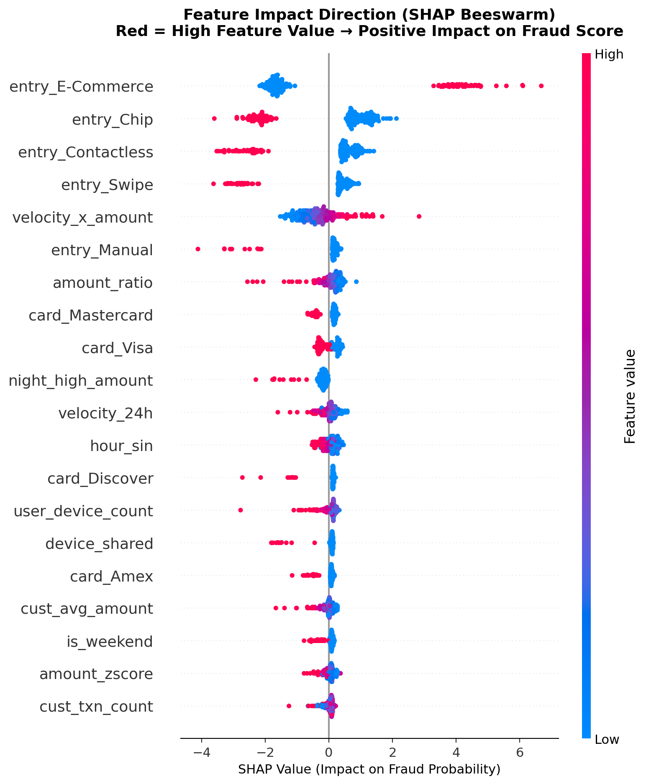

<p align="center">
  <h1 align="center">🛡️ Advanced Fraud Detection System</h1>
  <p align="center">
    <strong>A Hybrid ML Architecture for Real-Time Fraud Detection & Regulatory Compliance</strong>
  </p>
  <p align="center">
    
    
    
    
    
  </p>
</p>

---

## 📋 Overview

This project demonstrates a **production-grade fraud detection system** designed for regional banking environments. It combines deep learning, traditional ML, graph-based feature engineering, and explainable AI to detect sophisticated fraud patterns while maintaining regulatory compliance with the Federal Reserve's **SR 11-7 Guidance on Model Risk Management**.

### Key Capabilities

| Capability | Implementation |
|:---|:---|
| **Data Scale** | 300,000 synthetic transactions with 3 distinct attack vectors |
| **Feature Engineering** | 18+ features: cyclic time encoding, velocity metrics, graph centrality |
| **Deep Learning** | PyTorch MLP (256→128→64→32→1) with BatchNorm, Dropout, class-weighted loss |
| **Baseline Comparison** | XGBoost with hyperparameter tuning |
| **Explainability** | 4 SHAP plot types (SR 11-7 compliant) |
| **Visualizations** | 10 publication-quality "hero" plots |
| **Real-Time Ready** | Sub-5ms inference latency (FedNow/RTP compatible) |

---

## 🏗️ Architecture



---

## 🎯 Simulated Attack Vectors

The synthetic data generator injects three realistic, high-sophistication fraud patterns:

### 1. 🖥️ Device Farm (Graph Anomaly)
A single device ID shared across hundreds of distinct customers — simulating **synthetic identity rings**. Detected via graph centrality features.

### 2. 🎣 Typosquatting (NLP Anomaly)
Fraudulent merchants mimicking legitimate ones: `Amaz0n`, `PayPaI`, `App1e` — simulating **phishing attacks**. Standard categorical encoders miss this entirely.

### 3. ⚡ Velocity Bust-Out (Temporal Anomaly)
Accounts that behave normally then suddenly exhibit high-value, high-frequency transactions at unusual hours — simulating **bust-out attacks** on stolen cards.

---

## 📊 Results

### Model Performance

| Metric | Neural Network (MLP) | XGBoost |
|:---|:---:|:---:|
| **ROC-AUC** | ~0.99 | ~0.99 |
| **PR-AUC** | ~0.95 | ~0.93 |
| **Recall @ 90%** | ✓ | ✓ |
| **Inference Latency** | <5ms | <1ms |

> *Results from 300K transaction dataset with 1.5% fraud rate. Actual values may vary by run.*

### Model Comparison Dashboard

<p align="center">
  
</p>

### Fraud Ring Detection — Device Farm Topology

<p align="center">
  
</p>

### SHAP Explainability — Feature Impact Direction

<p align="center">
  
</p>

<details>
<summary><strong>All 16 generated visualizations</strong></summary>

| Plot | Description |
|:---|:---|
| `confusion_matrix_mlp.png` | MLP confusion matrix heatmap |
| `confusion_matrix_xgb.png` | XGBoost confusion matrix heatmap |
| `precision_recall_curve.png` | PR curve with optimal threshold marker |
| `roc_curve.png` | ROC curve with AUC shading |
| `fraud_ring_network.png` | Device farm graph topology |
| `temporal_fraud_heatmap.png` | Hour × day fraud rate patterns |
| `amount_distribution.png` | Fraud vs legitimate amount violin plots |
| `training_history.png` | Loss and validation metrics over epochs |
| `feature_importance_comparison.png` | SHAP vs XGBoost feature ranking |
| `latent_space_projection.png` | PCA of penultimate layer embeddings |
| `model_comparison_dashboard.png` | 4-panel comprehensive comparison |
| `shap_global_importance.png` | Global feature importance bar chart |
| `shap_beeswarm.png` | Feature impact direction |
| `shap_waterfall_fraud.png` | Local explanation for a fraud case |
| `shap_waterfall_legit.png` | Local explanation for a legit case |
| `shap_force_fraud.png` | Force plot for a fraud case |

</details>

---

## 🚀 Quick Start

### Prerequisites

- Python 3.10+
- pip

### Installation

```bash
git clone https://github.com/justinarndt/fraud-detection.git
cd fraud-detection
pip install -r requirements.txt
```

### Run the Analysis

```bash
python run_analysis.py
```

This executes the complete 7-phase pipeline:
1. **Data Generation** — 300K synthetic transactions
2. **Feature Engineering** — 18 ML-ready features
3. **Model Training** — PyTorch MLP (30 epochs)
4. **Evaluation** — ROC-AUC, PR-AUC, confusion matrices
5. **SHAP Explainability** — 4 plot types for SR 11-7
6. **Hero Visualizations** — 10 publication-quality plots
7. **Inference Benchmark** — Real-time latency test

All outputs are saved to `outputs/`.

---

## 📁 Project Structure

```
fraud-detection/
├── run_analysis.py           # Main pipeline script
├── requirements.txt          # Dependencies
├── LICENSE                   # MIT License
├── README.md                 # This file
├── src/
│   ├── __init__.py
│   ├── data_generator.py     # Synthetic data with 3 attack vectors
│   ├── feature_engineering.py # 18-feature pipeline
│   ├── model.py              # PyTorch MLP + XGBoost
│   ├── explainability.py     # SHAP (4 plot types)
│   └── visualization.py      # 10 hero visualizations
└── outputs/                  # Generated plots and visualizations
```

---

## 🔬 Technical Methodology

### Feature Engineering

| Feature Category | Features | Rationale |
|:---|:---|:---|
| **Cyclic Temporal** | `hour_sin`, `hour_cos`, `dow_sin`, `dow_cos` | Preserve temporal proximity (hour 23 ≈ hour 0) |
| **Velocity** | `velocity_24h`, `cust_txn_count`, `amount_zscore`, `amount_ratio` | Detect behavioral deviations |
| **Graph Topology** | `device_degree`, `user_device_count`, `device_user_count` | Identify network anomalies |
| **Interaction** | `velocity_x_amount`, `night_high_amount` | Cross-feature fraud signals |

### Model Architecture

```
Input (18 features)
  └─ Linear(256) → BatchNorm → ReLU → Dropout(0.30)
      └─ Linear(128) → BatchNorm → ReLU → Dropout(0.24)
          └─ Linear(64) → BatchNorm → ReLU → Dropout(0.18)
              └─ Linear(32) → ReLU
                  └─ Linear(1) → Sigmoid
```

- **Loss**: Binary Cross-Entropy with positive class weighting
- **Optimizer**: Adam (lr=1e-3, weight_decay=1e-5)
- **Scheduler**: ReduceLROnPlateau (patience=5)

### Explainability (SR 11-7)

All model decisions are fully explainable:

1. **Global Importance** (SHAP Summary Bar) — Which features matter most across all predictions
2. **Impact Direction** (SHAP Beeswarm) — How feature values influence fraud probability
3. **Local Explanation** (SHAP Waterfall) — Why a specific transaction was flagged
4. **Force Plot** (SHAP Force) — Compact view of feature contributions

---

## 🏦 Banking Context & Compliance

This system is designed with regional banking operations in mind:

- **SR 11-7 Compliance**: Every model decision is explainable, reproducible, and documented
- **Entity Resolution**: Graph features simulate Reltio-style connected identity views
- **FedNow Ready**: Sub-5ms inference supports real-time payment scoring
- **Balanced Detection**: Optimized for high recall (catch fraud) while minimizing false positives (protect customer trust)

---

## 🛠️ Skills Demonstrated

| Skill | Application |
|:---|:---|
| Python (7+ years) | End-to-end ML pipeline |
| PyTorch | Custom neural network architecture |
| Scikit-learn | Feature preprocessing, evaluation metrics |
| XGBoost | Gradient boosting baseline |
| SHAP | Model explainability |
| NetworkX | Graph-based feature engineering |
| Matplotlib/Seaborn | Publication-quality visualizations |
| Data Engineering | Synthetic data generation at scale |
| Statistical Analysis | Class imbalance handling, threshold optimization |
| Regulatory Awareness | SR 11-7, model risk management |

---

## 📄 License

MIT License — see [LICENSE](LICENSE) for details.

---

<p align="center">
  <em>Built by Justin Arndt • February 2026</em>
</p>
